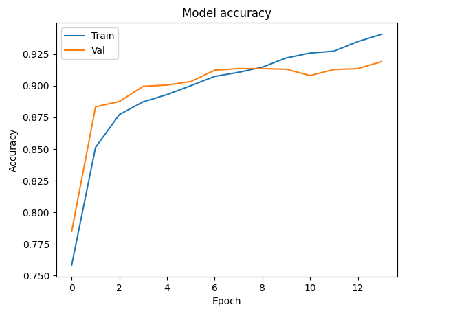
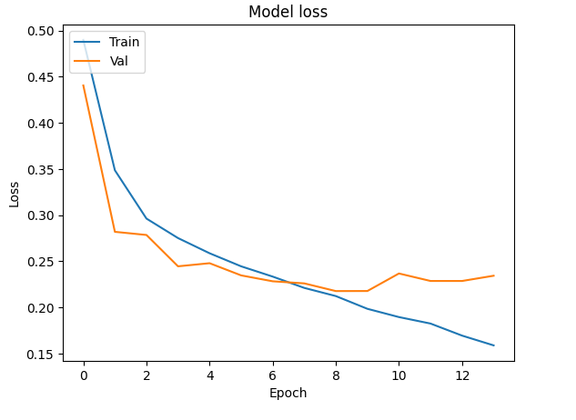

# Sentiment Analysis with GloVe and LSTM

This task implements a sentiment analysis model using GloVe word embeddings and LSTM. The dataset used is the IMDB Movie Reviews Dataset, which contains labeled text data (positive/negative sentiment). The project includes preprocessing, feature extraction using GloVe and building a deep learning model with TensorFlow/Keras to classify sentiments.

## Overview

This project demonstrates:
- Cleaning & preprocessing textual data.
- Using pre-trained GloVe embeddings to convert text into numerical vectors.
- Building a sentiment classification model with LSTMs in TensorFlow/Keras.
- Visualizing training metrics and evaluating the model's performance.

## Dataset
The dataset used is the IMDB Movie Reviews Dataset, which contains:
- **50,000 reviews**: 25,000 for training and 25,000 for testing.
- Two labels: `positive` and `negative`.

## Preprocessing
The following steps are applied to the dataset:
1. **Cleaning Reviews**:
   - Removing HTML tags.
   - Lowercasing text.
   - Removing special characters, URLs & non-alphanumeric characters.
   - Tokenizing text into words.

2. **Embedding Preparation**:
   - Loading pre-trained GloVe embeddings.
   - Mapping words to their corresponding 300-dimensional embedding vectors.

3. **Padding Sequences**:
   - Using TensorFlow's `pad_sequences` to ensure uniform input lengths.

## Model Architecture

The sentiment analysis model is built using TensorFlow/Keras and consists of the following layers:
1. **Embedding Layer**:
   - Uses the pre-trained GloVe embeddings (not trainable).
2. **SpatialDropout1D**:
   - Adds regularization by randomly dropping features.
3. **LSTM Layers**:
   - Two LSTM layers with 64 and 32 units, respectively.
4. **Dense Layer**:
   - A fully connected layer with a `sigmoid` activation for binary classification.

**Summary**:
```
Layer (type)                Output Shape              Param #
=================================================================
embedding (Embedding)       (None, 376, 300)          30,384,000
spatial_dropout1d (SpatialD (None, 376, 300)          0
lstm (LSTM)                 (None, 376, 64)           93,440
dropout (Dropout)           (None, 376, 64)           0
lstm_1 (LSTM)               (None, 32)               12,416
dropout_1 (Dropout)         (None, 32)               0
dense (Dense)               (None, 1)                33
=================================================================
Total params: 30,489,889
Trainable params: 105,889
Non-trainable params: 30,384,000
```

## Training
- Optimizer: **Adam**
- Loss function: **Binary Crossentropy**
- Metrics: **Accuracy**
- Batch Size: 128
- Validation Split: 20%
- Early stopping is applied to prevent overfitting.

### Training Results
- **Validation Accuracy**: ~90%
- **Test Accuracy**: 0.90609

## Results

### Metrics:
- **Accuracy**: 0.9061
- **Precision**: 0.9121
- **Recall**: 0.90037
- **F1-Score**: 0.9062

### Model Accuracy
- The training and validation accuracy over epochs.
- As shown, the model achieves high validation accuracy, with minimal overfitting.



### Model Loss
- The training and validation loss over epochs.
- Validation loss stabilizes as training progresses, indicating a well-optimized model.



## Predictions:
**Sample Review**: `"The movie was not great. I really expected action but there was none of that!"`

**Prediction**: `Negative`

**Sample Review**: `"This film was a joy to watch. Brilliant acting and a compelling story!"`

**Prediction**: `Positive`


## Acknowledgements
- [IMDB Dataset](https://ai.stanford.edu/~amaas/data/sentiment/)
- [GloVe Embeddings](https://nlp.stanford.edu/projects/glove/)
- [TensorFlow/Keras](https://www.tensorflow.org/)
